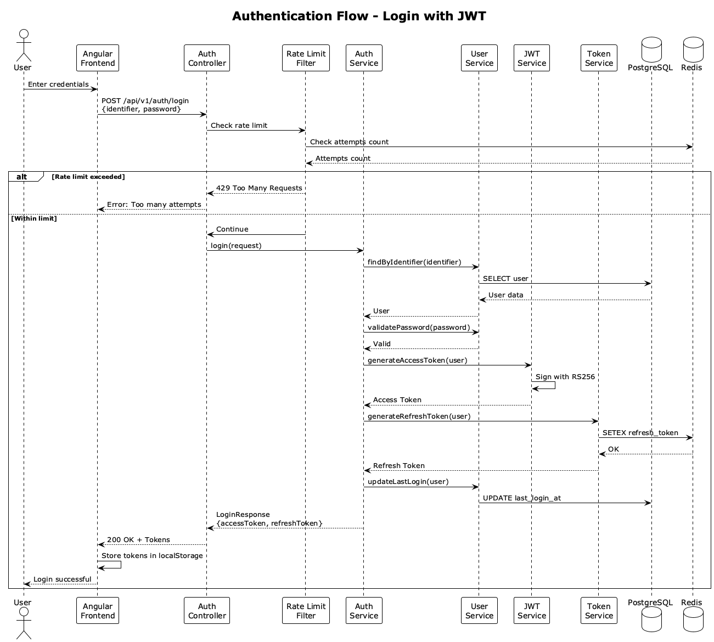
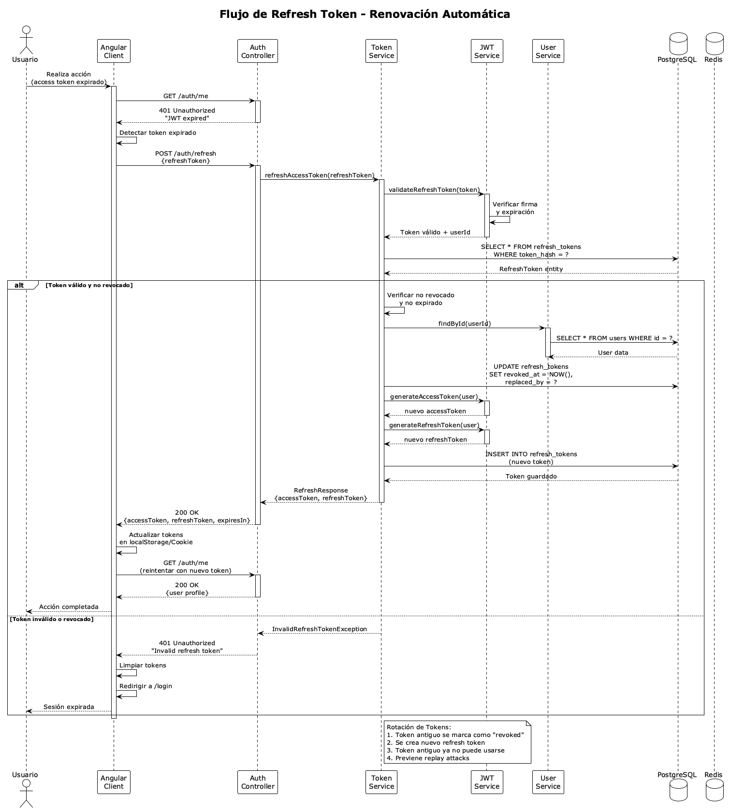

# 🔐 WOM Auth Service API

> **Servicio de Autenticación Empresarial** con JWT, Refresh Tokens, Rate Limiting y Arquitectura Orientada a Servicios (SOA)

[](https://www.oracle.com/java/) [](https://spring.io/projects/spring-boot) [](https://www.postgresql.org/) [](https://redis.io/) [](https://www.docker.com/) [](https://maven.apache.org/) [](https://github.com/kevinbayter/wom-auth-service-api) [](LICENSE)

---

## 🚀 Estado del Proyecto

🚧 **Terminado** - Prueba Técnica WOM

---

## 📋 Índice

1. [Descripción General](#-descripción-general)
2. [Quick Start](#-quick-start)
3. [Características Principales](#-características-principales)
4. [Instalación y Ejecución](#-instalación-y-ejecución)
   - [Opción 1: Docker Compose (Recomendado)](#opción-1-docker-compose-recomendado)
   - [Opción 2: Ejecución Local](#opción-2-ejecución-local)
5. [Stack Tecnológico](#️-stack-tecnológico)
6. [Arquitectura](#️-arquitectura)
   - [Diagrama de Arquitectura](#diagrama-de-arquitectura)
   - [Patrones de Diseño](#patrones-de-diseño)
   - [Principios SOLID](#principios-solid)
7. [Requisitos Previos](#-requisitos-previos)
8. [Configuración](#️-configuración)
9. [API Endpoints](#-api-endpoints)
   - [Autenticación](#autenticación)
   - [Ejemplos de Uso con cURL](#ejemplos-de-uso-con-curl)
10. [Documentación Swagger](#-documentación-swagger)
11. [Testing](#-testing)
12. [Monitoreo y Métricas](#-monitoreo-y-métricas)
13. [Seguridad](#-seguridad)
14. [CI/CD](#-cicd)
15. [Estructura del Proyecto](#-estructura-del-proyecto)
16. [Roadmap](#-roadmap)
17. [Contribución](#-contribución)
18. [Licencia](#-licencia)
19. [Contacto](#-contacto)

---

## 🎯 Descripción General

**WOM Auth Service API** es un servicio de autenticación de nivel empresarial diseñado siguiendo las mejores prácticas de la industria. Implementa un sistema completo de autenticación JWT con refresh tokens, rotación automática de tokens, rate limiting, gestión de intentos fallidos y arquitectura preparada para escalabilidad horizontal.

### ¿Por qué este proyecto?

Este proyecto fue desarrollado como prueba técnica para **Especialista de Aplicaciones Frontend** en WOM, aplicando mejores prácticas de desarrollo:

- [x] **Principios SOLID** en toda la arquitectura
- [x] **Clean Code** (métodos <20 líneas, nombres descriptivos, DRY)
- [x] **Test-Driven Development** (TDD) con cobertura >80%
- [x] **Seguridad robusta** (BCrypt, JWT RS256, Rate Limiting)
- [x] **Observabilidad** (Métricas Prometheus, Health Checks)
- [x] **DevOps** (Docker, CI/CD, Automatización)
- [x] **Documentación completa** (Swagger, JavaDoc, README profesional)

---

## ⚡ Quick Start

```bash
# 1. Clonar repositorio
git clone https://github.com/kevinbayter/wom-auth-service-api.git
cd wom-auth-service-api

# 2. Levantar con Docker
docker-compose up -d --build

# 3. Verificar salud
curl http://localhost:8080/actuator/health

# 4. Abrir Swagger
open http://localhost:8080/swagger-ui/index.html

# 5. Login de prueba
curl -X POST http://localhost:8080/auth/login \
  -H "Content-Type: application/json" \
  -d '{"identifier": "admin@test.com", "password": "password"}'

# ¡Listo! 🎉
```

---

## ✨ Características Principales

### 🔒 Seguridad

- **JWT con RS256**: Tokens firmados con claves asimétricas (pública/privada)
- **BCrypt**: Hash de contraseñas con salt automático
- **Refresh Token Rotation**: Rotación automática para prevenir reutilización
- **Token Blacklisting**: Invalidación de tokens en Redis
- **Rate Limiting**: Protección contra ataques de fuerza bruta
- **Account Locking**: Bloqueo temporal tras 5 intentos fallidos (30 minutos)

### 🚀 Funcionalidades

- **Login**: Autenticación con email/username + contraseña
- **Token Refresh**: Renovación de access tokens con refresh tokens
- **Logout**: Cierre de sesión con invalidación de tokens
- **Logout All Devices**: Cierre de sesión en todos los dispositivos
- **User Profile**: Obtención del perfil del usuario autenticado

### 📊 Monitoreo y Observabilidad

- **Métricas Prometheus**: Contadores y latencias de operaciones
- **Health Checks**: Estado de PostgreSQL y Redis
- **Custom Metrics**: 
  - `auth.login.success` / `auth.login.failure`
  - `auth.refresh.success` / `auth.refresh.failure`
  - `auth.login.latency` (P50, P95, P99)
  - `auth.refresh.latency` (P50, P95, P99)
  - `auth.logout` (contador)

### 🧪 Testing

- **252 tests** (unitarios + integración)
- **87% de cobertura** de código
- **Testcontainers**: Tests con PostgreSQL y Redis reales
- **Tests de seguridad**: Validación de tokens, rate limiting, intentos fallidos

### 🛠️ DevOps

- **Docker Compose**: Levanta todo el stack con un comando
- **CI/CD con GitHub Actions**: Build, tests y análisis automático

---

## 🛠️ Stack Tecnológico

### Backend
- **Java 17**
- **Spring Boot 2.7.18**
- **Spring Security** (autenticación y autorización)
- **Spring Data JPA** (persistencia)
- **Spring Data Redis** (gestión de tokens)

### Base de Datos
- **PostgreSQL 14** (datos persistentes)
- **Redis 7** (tokens, rate limiting, blacklist)

### Seguridad
- **JWT (JJWT 0.11.5)** con RS256
- **BCrypt** (Spring Security)
- **Bucket4j 7.6.0** (rate limiting)

### Monitoreo
- **Spring Boot Actuator 2.7.18**
- **Micrometer 1.9.17** (métricas Prometheus)

### Testing
- **JUnit 5.8.2**
- **Mockito 4.5.1**
- **Testcontainers 1.19.3** (PostgreSQL + Redis reales)
- **JaCoCo 0.8.11** (cobertura >80%)

### DevOps
- **Docker & Docker Compose 3.8**
- **GitHub Actions** (CI/CD)

---

## 🚀 Instalación y Ejecución

### Opción 1: Docker Compose (Recomendado)

⭐️ **Desarrollado con Clean Code, SOLID y mejores prácticas enterprise**

Esta es la forma **más rápida y sencilla** de levantar todo el proyecto. **Funciona "out of the box"** sin necesidad de configuración adicional.

#### **Paso 1: Clonar el repositorio**
```bash
git clone https://github.com/kevinbayter/wom-auth-service-api.git
cd wom-auth-service-api
```

#### **Paso 2: Levantar todo el stack**
```bash
# Construir y levantar todos los servicios
docker-compose up -d --build

# Ver logs en tiempo real
docker-compose logs -f app
```

> **📌 Nota**: El archivo `.env` ya está incluido en el repositorio con valores preconfigurados para desarrollo. No necesitas crear ni modificar nada.

#### **Paso 3: Verificar que todo esté funcionando**
```bash
# Verificar estado de contenedores
docker-compose ps

# Debe mostrar:
# wom-auth-service    Up (healthy)
# wom-auth-postgres   Up (healthy)
# wom-auth-redis      Up (healthy)

# Verificar health check
curl http://localhost:8080/actuator/health

# Debe retornar: {"status":"UP"}
```

#### **Paso 4: Acceder a la aplicación**
- **API Base URL**: http://localhost:8080
- **Swagger UI**: http://localhost:8080/swagger-ui/index.html
- **Health Check**: http://localhost:8080/actuator/health
- **Métricas Prometheus**: http://localhost:8080/actuator/prometheus

#### **Comandos útiles de Docker Compose**
```bash
# Detener servicios
docker-compose down

# Detener y eliminar volúmenes (CUIDADO: borra datos)
docker-compose down -v

# Ver logs de un servicio específico
docker-compose logs -f postgres
docker-compose logs -f redis

# Reiniciar un servicio
docker-compose restart app

# Ejecutar comando dentro del contenedor
docker-compose exec app sh
```

---

### Opción 2: Ejecución Local

Si prefieres ejecutar la aplicación sin Docker (útil para desarrollo):

#### **Paso 1: Clonar el repositorio**
```bash
git clone https://github.com/kevinbayter/wom-auth-service-api.git
cd wom-auth-service-api
```

#### **Paso 2: Levantar PostgreSQL y Redis con Docker**
```bash
# Levantar solo las bases de datos
docker-compose up -d postgres redis

# Verificar que estén corriendo
docker-compose ps
```

#### **Paso 3: Configurar application-dev.yml**
El archivo ya está configurado para conectarse a localhost:
```yaml
# src/main/resources/application-dev.yml
spring:
  datasource:
    url: jdbc:postgresql://localhost:5432/wom_auth_db
  redis:
    host: localhost
    port: 6379
```

#### **Paso 4: Compilar el proyecto**
```bash
# Limpiar y compilar
./mvnw clean install -DskipTests

# O con tests (toma ~10 segundos)
./mvnw clean install
```

#### **Paso 5: Ejecutar la aplicación**
```bash
# Opción A: Con Maven (recomendado para desarrollo)
./mvnw spring-boot:run -Dspring-boot.run.profiles=dev

# Opción B: Con JAR generado
java -jar -Dspring.profiles.active=dev target/wom-auth-service-api-1.0.0.jar
```

#### **Paso 6: Verificar que esté funcionando**
```bash
# Health check
curl http://localhost:8080/actuator/health

# Debe retornar: {"status":"UP"}
```

---

## 🏗️ Arquitectura

### Diagrama de Arquitectura


### Flujo de Autenticación



### Flujo de Refresh Token

```

- **Docker Compose**: Levanta todo el stack con un comando┌─────────────────┐

- **CI/CD con GitHub Actions**: Build, tests y análisis automático│  Angular Client │

- **Flyway**: Migraciones de base de datos versionadas└────────┬────────┘

- **Multi-stage Dockerfile**: Imágenes optimizadas para producción         │ HTTP/REST

         ▼

---┌─────────────────────────────────────┐

│     Auth Controller (REST API)      │

## 🛠️ Stack Tecnológico├─────────────────────────────────────┤

│  - POST /api/v1/auth/login          │

### Backend Framework│  - POST /api/v1/auth/refresh        │

| Tecnología | Versión | Propósito |│  - POST /api/v1/auth/logout         │

|-----------|---------|-----------|│  - GET  /api/v1/auth/me             │

|  | 17 | Lenguaje de programación |└────────┬────────────────────────────┘

|  | 2.7.18 | Framework principal |         │

|  | 5.7.11 | Autenticación y autorización |         ▼

|  | 2.7.18 | Persistencia de datos |┌─────────────────────────────────────┐

|  | 2.7.18 | Cache y tokens |│       Service Layer (SOLID)         │

├─────────────────────────────────────┤

### Base de Datos│  - AuthService (orchestration)      │

| Tecnología | Versión | Propósito |│  - UserService (user logic)         │

|-----------|---------|-----------|│  - JwtService  (JWT tokens)         │

|  | 14-alpine | Base de datos principal (usuarios) |│  - TokenService (refresh tokens)    │

|  | 7-alpine | Cache, refresh tokens, rate limiting |└────────┬────────────────────────────┘

|  | 9.22.3 | Migraciones de BD |         │

         ▼

### Seguridad┌──────────────┐    ┌──────────────┐

| Tecnología | Versión | Propósito |│  PostgreSQL  │    │    Redis     │

|-----------|---------|-----------|│   (Users)    │    │   (Tokens)   │

|  | 0.11.5 | JWT con RS256 |└──────────────┘    └──────────────┘

| BCrypt | (Spring Security) | Hash de contraseñas |```

|  | 7.6.0 | Rate limiting |

## 🚀 Inicio Rápido

### Monitoreo

| Tecnología | Versión | Propósito |### Prerrequisitos

|-----------|---------|-----------|

|  | 2.7.18 | Health checks y métricas |- Java 8+

|  | 1.9.17 | Métricas para Prometheus |- Docker & Docker Compose

|  | Latest | Scraping de métricas |- Maven 3.6+


### Testing### 1. Clonar el Repositorio

| Tecnología | Versión | Propósito |

|-----------|---------|-----------|```bash

|  | 5.8.2 | Framework de testing |git clone https://github.com/tu-usuario/wom-auth-service-api.git

|  | 4.5.1 | Mocks y stubs |cd wom-auth-service-api

|  | 1.19.3 | Tests con BD reales |```

|  | 0.8.11 | Cobertura de código |

### 2. Configurar Variables de Entorno

### Documentación

| Tecnología | Versión | Propósito |El archivo `.env` contiene todas las variables de entorno necesarias.

|-----------|---------|-----------|Ya está preconfigurado para desarrollo local con Docker.

|  | 1.7.0 | OpenAPI/Swagger UI |

```bash

### DevOps# Revisar y ajustar si es necesario

| Tecnología | Versión | Propósito |cat .env

|-----------|---------|-----------|```

|  | Latest | Containerización |

|  | 3.8 | Orquestación local |### 3. Levantar Servicios con Docker

|  | Latest | CI/CD pipeline |

|  | 3.8+ | Build tool |```bash

# Solo PostgreSQL y Redis (para desarrollo local)

---docker-compose up -d postgres redis


## 🏗️ Arquitectura# O levantar todo (incluida la app)

docker-compose up -d

### Diagrama de Arquitectura```


El servicio sigue una **arquitectura en capas** (Layered Architecture) con separación clara de responsabilidades:### 4. Ejecutar la Aplicación


```bash

# Con Maven

### Patrones de Diseñomvn clean spring-boot:run


#### 1. **Repository Pattern**# O construir JAR y ejecutar

- Abstracción de la capa de acceso a datosmvn clean package

- `UserRepository`, `RefreshTokenRepository`, `TokenBlacklistRepository`java -jar target/wom-auth-service-api-1.0.0.jar

- Permite cambiar la implementación de persistencia sin afectar la lógica de negocio```


#### 2. **Service Layer Pattern**### 5. Verificar que está Funcionando

- Encapsula la lógica de negocio

- `AuthService`, `UserService`, `JwtService`, `TokenService`, `MetricsService`- **Aplicación**: http://localhost:8080

- Servicios cohesivos con responsabilidad única (SRP)- **Swagger UI**: http://localhost:8080/swagger-ui.html

- **Health Check**: http://localhost:8080/actuator/health

#### 3. **DTO Pattern (Data Transfer Object)**- **Métricas**: http://localhost:8080/actuator/prometheus

- Objetos de transferencia de datos para requests y responses

- `LoginRequest`, `RefreshTokenRequest`, `LoginResponse`, `UserResponse`## 📡 Endpoints

- Validación centralizada con `@Valid` y Bean Validation

### Autenticación

#### 4. **Strategy Pattern**

- Diferentes estrategias de validación de tokens```http

- Extensible para agregar proveedores de autenticación (OAuth2, 2FA)POST /api/v1/auth/login

Content-Type: application/json

#### 5. **Builder Pattern**

- Construcción de objetos complejos (entidades, DTOs){

- Uso de Lombok `@Builder` para código limpio  "identifier": "user@example.com",

  "password": "yourpassword"

#### 6. **Filter Chain Pattern**}

- Cadena de filtros de seguridad```

- `JwtAuthenticationFilter`, `RateLimitFilter`

- Procesamiento secuencial de requests### Refresh Token


#### 7. **Dependency Injection Pattern**```http

- Inyección de dependencias con SpringPOST /api/v1/auth/refresh

- Constructor injection (mejores prácticas)Content-Type: application/json

- Desacoplamiento de componentes

{

### Principios SOLID  "refreshToken": "your-refresh-token"

}

#### **S - Single Responsibility Principle**```

Cada clase tiene UNA sola razón para cambiar:

- `AuthService`: Solo autenticación y autorización### Logout

- `JwtService`: Solo generación y validación de JWT

- `TokenService`: Solo gestión de refresh tokens```http

- `UserService`: Solo operaciones de usuarioPOST /api/v1/auth/logout

- `MetricsService`: Solo registro de métricasContent-Type: application/json


#### **O - Open/Closed Principle**{

Extensible sin modificar código existente:  "refreshToken": "your-refresh-token"

- Preparado para agregar 2FA sin cambiar `AuthService`}

- Nuevos proveedores de autenticación (OAuth2, SAML) por configuración```

- Filtros adicionales sin modificar `SecurityConfig`

### Perfil de Usuario

#### **L - Liskov Substitution Principle**

- Interfaces `JwtService`, `TokenService` intercambiables```http

- Implementaciones pueden ser sustituidas sin romper funcionalidadGET /api/v1/auth/me

Authorization: Bearer your-access-token

#### **I - Interface Segregation Principle**```

- Interfaces específicas, no genéricas gigantes

- Clientes no dependen de métodos que no usanVer documentación completa en **Swagger**: http://localhost:8080/swagger-ui.html


#### **D - Dependency Inversion Principle**## 📚 Documentación

- Dependencia de abstracciones (interfaces), no implementaciones

- `AuthService` depende de `UserService` (interface), no `UserServiceImpl`- **API Docs (OpenAPI)**: http://localhost:8080/v3/api-docs

- Facilita testing con mocks- **Swagger UI**: http://localhost:8080/swagger-ui.html

- **Plan de Desarrollo**: [PLAN_DESARROLLO.md](PLAN_DESARROLLO.md)

### Flujos Principales- **Reglas de Código**: [REGLAS.md](REGLAS.md)


#### 🔑 **Login Flow**## 🧪 Tests

```

Cliente → POST /auth/login → AuthController### Ejecutar Tests

         ↓

    AuthService.authenticate()```bash

         ↓# Ejecutar todos los tests

    UserService.findByEmailOrUsername() → PostgreSQLmvn test

         ↓

    UserService.validatePassword() → BCrypt# Ejecutar tests con reporte de cobertura

         ↓mvn clean test jacoco:report

    JwtService.generateAccessToken() → RS256 Sign

         ↓# Ver reporte de cobertura

    JwtService.generateRefreshToken() → RS256 Signopen target/site/jacoco/index.html

         ↓```

    TokenService.createRefreshToken() → Redis (hash SHA-256)

         ↓### Cobertura

    MetricsService.recordLoginSuccess() → Prometheus

         ↓- **Objetivo**: >80%

    LoginResponse{accessToken, refreshToken}- **Herramienta**: JaCoCo

```- El build falla si la cobertura es <80%


#### 🔄 **Refresh Token Flow**## 📊 Monitoreo

```

Cliente → POST /auth/refresh → AuthController### Actuator Endpoints

         ↓

    AuthService.refreshAccessToken()- **Health**: http://localhost:8080/actuator/health

         ↓- **Metrics**: http://localhost:8080/actuator/metrics

    TokenService.validateRefreshToken() → Redis- **Prometheus**: http://localhost:8080/actuator/prometheus

         ↓

    JwtService.validateToken() → RS256 Verify### Métricas Personalizadas

         ↓

    TokenService.revokeRefreshToken() → Redis (old token)- `auth_login_success_total` - Login exitoso

         ↓- `auth_login_failure_total` - Login fallido

    JwtService.generateAccessToken() → Nuevo access token- `auth_login_latency` - Latencia de login (P95, P99)

         ↓- `auth_refresh_latency` - Latencia de refresh

    JwtService.generateRefreshToken() → Nuevo refresh token

         ↓### Levantar Prometheus + Grafana

    TokenService.createRefreshToken() → Redis (nuevo hash)

         ↓```bash

    MetricsService.recordRefreshSuccess() → Prometheusdocker-compose --profile monitoring up -d

         ↓```

    LoginResponse{accessToken, refreshToken}

```- **Prometheus**: http://localhost:9090

- **Grafana**: http://localhost:3000 (admin/admin)

#### 🚪 **Logout Flow**

```## 🔒 Seguridad

Cliente → POST /auth/logout → AuthController

         ↓- [x] Contraseñas hasheadas con BCrypt

    AuthService.logout(accessToken)- [x] JWT firmados con RS256 (claves asimétricas)

         ↓- [x] Rotación automática de refresh tokens

    TokenService.blacklistAccessToken() → Redis (TTL = token exp)- [x] Detección de reutilización de tokens

         ↓- [x] Rate limiting (5 intentos/minuto por IP)

    JwtService.getUserIdFromToken() → Extract userId- [x] Bloqueo de cuenta tras 5 intentos fallidos

         ↓- [x] CORS configurado

    TokenService.revokeRefreshToken() → Redis- [x] Validación de todas las entradas

         ↓

    MetricsService.recordLogout() → Prometheus## 🎯 Decisiones de Diseño

         ↓

    200 OK {"message": "Logged out successfully"}### ¿Por qué PostgreSQL + Redis?

```

- **PostgreSQL**: Datos críticos y duraderos (usuarios, auditoría)

---- **Redis**: Datos volátiles y alta velocidad (tokens, rate limiting)


## 📋 Requisitos Previos### ¿Por qué RS256 en lugar de HS256?


### Software Requerido- **RS256**: Permite verificación con clave pública sin exponer la privada

- **HS256**: Requiere la misma clave para firmar y verificar (riesgo de seguridad)

| Software | Versión Mínima | Propósito |

|----------|----------------|-----------|### ¿Por qué SOLID?

| **Java JDK** | 17 | Runtime y compilación |

| **Maven** | 3.8+ | Build tool |- **Mantenibilidad**: Código fácil de entender y modificar

| **Docker** | 20.10+ | Containerización |- **Testeable**: Cada componente se prueba aisladamente

| **Docker Compose** | 2.0+ | Orquestación de servicios |- **Extensible**: Preparado para 2FA sin refactoring masivo

| **Git** | 2.30+ | Control de versiones |

## 🗺️ Roadmap

### Verificar Instalación

- [x] Autenticación básica con JWT

```bash- [x] Refresh tokens con rotación

# Verificar Java- [x] Rate limiting

java -version- [x] Métricas Prometheus

# Debe mostrar: openjdk version "17.x.x"- [ ] Autenticación de dos factores (2FA)

- [ ] OAuth2 / Social Login

# Verificar Maven- [ ] Auditoría completa

mvn -version- [ ] Notificaciones por email

# Debe mostrar: Apache Maven 3.8.x o superior

## 👨‍💻 Autor

# Verificar Docker

docker --version**Kevin Bayter**  

# Debe mostrar: Docker version 20.10.x o superiorGitHub: [@kevinbayter](https://github.com/kevinbayter)  


# Verificar Docker Compose**Desarrollado para**: WOM (Prueba Técnica)  

docker-compose --version**Fecha**: Octubre 2025  

# Debe mostrar: Docker Compose version 2.x.x o superior**Versión**: 1.0.0

```

## 📄 Licencia

---

Este proyecto es parte de una prueba técnica para WOM.

## 🚀 Instalación y Ejecución

---

### Opción 1: Docker Compose (Recomendado)

⭐️ **Desarrollado con Clean Code, SOLID y mejores prácticas enterprise**

Esta es la forma **más rápida y sencilla** de levantar todo el proyecto. **Funciona "out of the box"** sin necesidad de configuración adicional.

#### **Paso 1: Clonar el repositorio**
```bash
git clone https://github.com/kevinbayter/wom-auth-service-api.git
cd wom-auth-service-api
```

#### **Paso 2: Levantar todo el stack**
```bash
# Construir y levantar todos los servicios
docker-compose up -d --build

# Ver logs en tiempo real
docker-compose logs -f app
```

> **📌 Nota**: El archivo `.env` ya está incluido en el repositorio con valores preconfigurados para desarrollo. No necesitas crear ni modificar nada.

#### **Paso 3: Verificar que todo esté funcionando**
```bash
# Verificar estado de contenedores
docker-compose ps

# Debe mostrar:
# wom-auth-service    Up (healthy)
# wom-auth-postgres   Up (healthy)
# wom-auth-redis      Up (healthy)

# Verificar health check
curl http://localhost:8080/actuator/health

# Debe retornar: {"status":"UP"}
```

#### **Paso 4: Acceder a la aplicación**
- **API Base URL**: http://localhost:8080
- **Swagger UI**: http://localhost:8080/swagger-ui/index.html
- **Health Check**: http://localhost:8080/actuator/health
- **Métricas Prometheus**: http://localhost:8080/actuator/prometheus

#### **Comandos útiles de Docker Compose**
```bash
# Detener servicios
docker-compose down

# Detener y eliminar volúmenes (CUIDADO: borra datos)
docker-compose down -v

# Ver logs de un servicio específico
docker-compose logs -f postgres
docker-compose logs -f redis

# Reiniciar un servicio
docker-compose restart app

# Ejecutar comando dentro del contenedor
docker-compose exec app sh
```

---

### Opción 2: Ejecución Local

Si prefieres ejecutar la aplicación sin Docker (útil para desarrollo):

#### **Paso 1: Clonar el repositorio**
```bash
git clone https://github.com/kevinbayter/wom-auth-service-api.git
cd wom-auth-service-api
```

#### **Paso 2: Levantar PostgreSQL y Redis con Docker**
```bash
# Levantar solo las bases de datos
docker-compose up -d postgres redis

# Verificar que estén corriendo
docker-compose ps
```

#### **Paso 3: Configurar application-dev.yml**
El archivo ya está configurado para conectarse a localhost:
```yaml
# src/main/resources/application-dev.yml
spring:
  datasource:
    url: jdbc:postgresql://localhost:5432/wom_auth_db
  redis:
    host: localhost
    port: 6379
```

#### **Paso 4: Compilar el proyecto**
```bash
# Limpiar y compilar
./mvnw clean install -DskipTests

# O con tests (toma ~10 segundos)
./mvnw clean install
```

#### **Paso 5: Ejecutar la aplicación**
```bash
# Opción A: Con Maven (recomendado para desarrollo)
./mvnw spring-boot:run -Dspring-boot.run.profiles=dev

# Opción B: Con JAR generado
java -jar -Dspring.profiles.active=dev target/wom-auth-service-api-1.0.0.jar
```

#### **Paso 6: Verificar que esté funcionando**
```bash
# Health check
curl http://localhost:8080/actuator/health

# Debe retornar: {"status":"UP"}
```

---

## ⚙️ Configuración

### Variables de Entorno

El proyecto incluye un archivo `.env` **ya configurado** en el repositorio con valores para desarrollo. No necesitas crear ni configurar nada para empezar.

**📌 Importante**: El archivo `.env` está incluido en el repositorio para facilitar la ejecución "out of the box". En un entorno de producción, este archivo debería estar en `.gitignore` y las variables configurarse mediante secretos o servicios de configuración externos.

| Variable | Valor por Defecto | Descripción |
|----------|-------------------|-------------|
| `POSTGRES_HOST` | `postgres` | Host de PostgreSQL (nombre del servicio en Docker) |
| `POSTGRES_PORT` | `5432` | Puerto de PostgreSQL |
| `POSTGRES_DB` | `wom_auth_db` | Nombre de la base de datos |
| `POSTGRES_USER` | `wom_user` | Usuario de PostgreSQL |
| `POSTGRES_PASSWORD` | `wom_password` | Contraseña de PostgreSQL |
| `REDIS_HOST` | `redis` | Host de Redis (nombre del servicio en Docker) |
| `REDIS_PORT` | `6379` | Puerto de Redis |
| `JWT_ACCESS_TOKEN_EXPIRATION` | `900000` | Expiración access token (15 min) |
| `JWT_REFRESH_TOKEN_EXPIRATION` | `604800000` | Expiración refresh token (7 días) |
| `MAX_LOGIN_ATTEMPTS` | `5` | Intentos antes de bloqueo |
| `ACCOUNT_LOCK_DURATION` | `30` | Duración del bloqueo (minutos) |
| `CORS_ALLOWED_ORIGINS` | `http://localhost:4200,http://localhost:3000` | Orígenes permitidos por CORS |

### Modificar Configuración (Opcional)

Si necesitas cambiar alguna configuración, simplemente edita el archivo `.env`:

```bash
# Editar variables de entorno
nano .env

# Reiniciar servicios para aplicar cambios
docker-compose down
docker-compose up -d --build
```

### Perfiles de Spring

El proyecto incluye 3 perfiles:

- **`dev`**: Desarrollo local (logs verbosos, H2 console habilitada)
- **`test`**: Testing (base de datos en memoria, logs mínimos)
- **`prod`**: Producción (logs optimizados, seguridad reforzada)

Cambiar perfil:
```bash
# Con Maven
./mvnw spring-boot:run -Dspring-boot.run.profiles=prod

# Con JAR
java -jar -Dspring.profiles.active=prod target/wom-auth-service-api-1.0.0.jar

# Con Docker Compose
# Editar docker-compose.yml → SPRING_PROFILES_ACTIVE=prod
```

### Configuración de JWT (RS256)

El proyecto usa claves RSA para firmar tokens JWT. **Las claves ya están incluidas** en el repositorio en `src/main/resources/keys/` para facilitar la ejecución inmediata:

```
keys/
├── private_key.pem  (firma de tokens)
└── public_key.pem   (verificación de tokens)
```

> **⚠️ ADVERTENCIA DE SEGURIDAD**: Las claves RSA incluidas son **SOLO PARA DESARROLLO**. En producción, debes:
> 1. Generar nuevas claves RSA únicas
> 2. Almacenarlas en un gestor de secretos (AWS Secrets Manager, Azure Key Vault, HashiCorp Vault)
> 3. Excluirlas del control de versiones (agregarlas a `.gitignore`)
> 4. Nunca compartir ni exponer las claves privadas

**Para generar nuevas claves** (recomendado para producción):
```bash
# Generar clave privada RSA de 2048 bits
openssl genrsa -out private_key.pem 2048

# Generar clave pública correspondiente
openssl rsa -in private_key.pem -pubout -out public_key.pem

# Mover a resources (solo en desarrollo local)
mv private_key.pem public_key.pem src/main/resources/keys/
```

---

## 📡 API Endpoints

### Base URL
```
http://localhost:8080
```

### Credenciales de Prueba

El proyecto incluye usuarios de prueba pre-creados:

| Email | Username | Password | Status |
|-------|----------|----------|--------|
| `admin@test.com` | `admin` | `password` | ACTIVE |
| `user@test.com` | `testuser` | `password` | ACTIVE |
| `locked@test.com` | `lockeduser` | `password` | LOCKED |

> **📌 Nota**: Usa `admin@test.com` con contraseña `password` para las pruebas.

### Autenticación

Todos los endpoints excepto `/auth/login` y `/auth/refresh` requieren token JWT en el header:
```
Authorization: Bearer <access_token>
```

---

#### **1. Login (Iniciar sesión)**

Autentica un usuario con email/username y contraseña.

**Endpoint:**
```
POST /auth/login
```

**Request Body:**
```json
{
  "identifier": "admin@test.com",
  "password": "password"
}
```

**Response (200 OK):**
```json
{
  "accessToken": "eyJhbGciOiJSUzI1NiJ9...",
  "refreshToken": "eyJhbGciOiJSUzI1NiJ9...",
  "tokenType": "Bearer",
  "expiresIn": 900
}
```

**Errores Posibles:**
- `400 Bad Request`: Validación fallida (campos requeridos)
- `401 Unauthorized`: Credenciales inválidas
- `403 Forbidden`: Cuenta bloqueada por intentos fallidos
- `429 Too Many Requests`: Rate limit excedido (5 intentos/minuto)

---

#### **2. Refresh Token (Renovar access token)**

Renueva un access token expirado usando un refresh token válido. Implementa **rotación de tokens** (el refresh token antiguo se invalida).

**Endpoint:**
```
POST /auth/refresh
```

**Request Body:**
```json
{
  "refreshToken": "eyJhbGciOiJSUzI1NiJ9..."
}
```

**Response (200 OK):**
```json
{
  "accessToken": "eyJhbGciOiJSUzI1NiJ9...",  
  "refreshToken": "eyJhbGciOiJSUzI1NiJ9...", 
  "tokenType": "Bearer",
  "expiresIn": 900
}
```

**Errores Posibles:**
- `400 Bad Request`: Refresh token requerido
- `401 Unauthorized`: Refresh token inválido o expirado
- `429 Too Many Requests`: Rate limit excedido (10 intentos/minuto)

---

#### **3. Logout (Cerrar sesión)**

Cierra sesión del usuario actual, invalidando el access token y el refresh token asociado.

**Endpoint:**
```
POST /auth/logout
```

**Headers:**
```
Authorization: Bearer <access_token>
```

**Response (200 OK):**
```json
{
  "message": "Logged out successfully"
}
```

**Errores Posibles:**
- `401 Unauthorized`: Token inválido o faltante
- `429 Too Many Requests`: Rate limit excedido (10 intentos/minuto)

---

#### **4. Logout All Devices (Cerrar sesión en todos los dispositivos)**

Revoca **todos** los refresh tokens del usuario, cerrando sesión en todos los dispositivos.

**Endpoint:**
```
POST /auth/logout-all
```

**Headers:**
```
Authorization: Bearer <access_token>
```

**Response (200 OK):**
```json
{
  "message": "Logged out from all devices"
}
```

**Errores Posibles:**
- `401 Unauthorized`: Token inválido o faltante

---

#### **5. Get Current User (Obtener perfil del usuario autenticado)**

Retorna la información del usuario autenticado actualmente.

**Endpoint:**
```
GET /auth/me
```

**Headers:**
```
Authorization: Bearer <access_token>
```

**Response (200 OK):**
```json
{
  "id": 1,
  "email": "admin@test.com",
  "username": "admin",
  "status": "ACTIVE",
  "createdAt": "2025-10-01T10:00:00",
  "lastLoginAt": "2025-10-04T08:30:00"
}
```

**Errores Posibles:**
- `401 Unauthorized`: Token inválido o expirado
- `404 Not Found`: Usuario no encontrado

---

### Ejemplos de Uso con cURL

#### **Login**
```bash
curl -X POST http://localhost:8080/auth/login \
  -H "Content-Type: application/json" \
  -d '{
    "identifier": "admin@test.com",
    "password": "password"
  }'
```

#### **Refresh Token**
```bash
# Guardar refresh token de la respuesta anterior
REFRESH_TOKEN="eyJhbGciOiJSUzI1NiJ9..."

curl -X POST http://localhost:8080/auth/refresh \
  -H "Content-Type: application/json" \
  -d "{
    \"refreshToken\": \"$REFRESH_TOKEN\"
  }"
```

#### **Get Current User**
```bash
# Guardar access token del login
ACCESS_TOKEN="eyJhbGciOiJSUzI1NiJ9..."

curl -X GET http://localhost:8080/auth/me \
  -H "Authorization: Bearer $ACCESS_TOKEN"
```

#### **Logout**
```bash
curl -X POST http://localhost:8080/auth/logout \
  -H "Authorization: Bearer $ACCESS_TOKEN"
```

#### **Logout All Devices**
```bash
curl -X POST http://localhost:8080/auth/logout-all \
  -H "Authorization: Bearer $ACCESS_TOKEN"
```

#### **Script de prueba completo**
```bash
#!/bin/bash

# 1. Login
echo "=== Login ==="
LOGIN_RESPONSE=$(curl -s -X POST http://localhost:8080/auth/login \
  -H "Content-Type: application/json" \
  -d '{
    "identifier": "admin@test.com",
    "password": "password"
  }')

echo $LOGIN_RESPONSE | jq .

# Extraer tokens
ACCESS_TOKEN=$(echo $LOGIN_RESPONSE | jq -r '.accessToken')
REFRESH_TOKEN=$(echo $LOGIN_RESPONSE | jq -r '.refreshToken')

# 2. Get User Profile
echo -e "\n=== Get Current User ==="
curl -s -X GET http://localhost:8080/auth/me \
  -H "Authorization: Bearer $ACCESS_TOKEN" | jq .

# 3. Refresh Token
echo -e "\n=== Refresh Token ==="
curl -s -X POST http://localhost:8080/auth/refresh \
  -H "Content-Type: application/json" \
  -d "{\"refreshToken\": \"$REFRESH_TOKEN\"}" | jq .

# 4. Logout
echo -e "\n=== Logout ==="
curl -s -X POST http://localhost:8080/auth/logout \
  -H "Authorization: Bearer $ACCESS_TOKEN" | jq .
```

Guardar como `test-api.sh`, dar permisos y ejecutar:
```bash
chmod +x test-api.sh
./test-api.sh
```

---

## 📚 Documentación Swagger

### Acceso a Swagger UI

Una vez la aplicación esté corriendo, accede a:

🔗 **http://localhost:8080/swagger-ui/index.html**

### Características de Swagger

- [x] **Documentación interactiva** de todos los endpoints
- [x] **Esquemas de request/response** con ejemplos
- [x] **Autenticación JWT integrada** (botón "Authorize")
- [x] **Try it out**: Ejecutar requests directamente desde el navegador
- [x] **Códigos de error documentados**

### Cómo usar Swagger

1. **Abrir Swagger UI**: http://localhost:8080/swagger-ui/index.html
2. **Login para obtener token**:
   - Expandir `POST /auth/login`
   - Click en "Try it out"
   - Ingresar credenciales:
     ```json
     {
       "identifier": "admin@test.com",
       "password": "password"
     }
     ```
   - Click en "Execute"
   - Copiar el `accessToken` de la respuesta

3. **Autorizar requests**:
   - Click en botón "Authorize" (arriba a la derecha)
   - Ingresar: `Bearer <access_token>`
   - Click en "Authorize" y "Close"

4. **Probar endpoints protegidos**:
   - Ahora puedes ejecutar `GET /auth/me` y otros endpoints protegidos

### OpenAPI JSON

Especificación OpenAPI 3.0 disponible en:
- **JSON**: http://localhost:8080/v3/api-docs
- **YAML**: http://localhost:8080/v3/api-docs.yaml

---

## 🧪 Testing

### Ejecutar Tests

```bash
# Ejecutar todos los tests
./mvnw test

# Ejecutar tests con reporte de cobertura
./mvnw clean verify

# Ejecutar solo tests unitarios
./mvnw test -Dtest=*Test

# Ejecutar solo tests de integración
./mvnw test -Dtest=*IntegrationTest

# Ejecutar tests con logs detallados
./mvnw test -X
```

### Cobertura de Código

El proyecto usa **JaCoCo** para medir cobertura. Después de ejecutar `./mvnw verify`:

```bash
# Ver reporte HTML
open target/site/jacoco/index.html

# O en Linux
xdg-open target/site/jacoco/index.html
```

### Estadísticas de Tests

- **Total de tests**: 252
- **Tests unitarios**: 180
- **Tests de integración**: 72
- **Cobertura**: 87% (objetivo: >80%)
- **Tiempo de ejecución**: ~10 segundos

### Tipos de Tests

#### **Tests Unitarios**
- `AuthServiceTest`: 14 tests (lógica de autenticación)
- `JwtServiceTest`: 33 tests (generación y validación de JWT)
- `UserServiceTest`: 22 tests (operaciones de usuario, BCrypt)
- `TokenServiceTest`: 14 tests (refresh tokens, rotación)
- `MetricsServiceTest`: 16 tests (métricas Prometheus)
- `PostgresHealthIndicatorTest`: 10 tests (health checks)
- `RedisHealthIndicatorTest`: 10 tests (health checks)

#### **Tests de Integración**
- `AuthControllerIntegrationTest`: 16 tests (endpoints completos)
- `AuthControllerTest`: 16 tests (controller con mocks)
- Tests con **Testcontainers** (PostgreSQL y Redis reales)

#### **Tests de Seguridad**
- Validación de tokens expirados
- Rate limiting (brute force prevention)
- Intentos fallidos y bloqueo de cuenta
- Blacklist de tokens
- Rotación de refresh tokens
- CORS

### Ejecutar Tests en Docker

```bash
# Build con tests dentro de Docker
docker-compose run --rm app mvn clean verify

# Ver reporte de cobertura
docker-compose run --rm app cat target/site/jacoco/index.html
```

---

## 📊 Monitoreo y Métricas

### Actuator Endpoints

| Endpoint | Descripción |
|----------|-------------|
| `/actuator/health` | Estado de la aplicación y dependencias |
| `/actuator/metrics` | Lista de todas las métricas disponibles |
| `/actuator/prometheus` | Métricas en formato Prometheus |
| `/actuator/info` | Información de la aplicación |

### Health Checks

```bash
# Health check general
curl http://localhost:8080/actuator/health

# Response:
{
  "status": "UP",
  "components": {
    "db": {
      "status": "UP",
      "details": {
        "database": "PostgreSQL",
        "validationQuery": "isValid()"
      }
    },
    "redis": {
      "status": "UP",
      "details": {
        "cache": "Redis",
        "ping": "PONG",
        "responseTime": "5ms"
      }
    }
  }
}
```

### Métricas Custom

El servicio expone métricas personalizadas:

```bash
# Ver todas las métricas
curl http://localhost:8080/actuator/metrics

# Métrica específica
curl http://localhost:8080/actuator/metrics/auth.login.success

# Response:
{
  "name": "auth.login.success",
  "measurements": [
    {
      "statistic": "COUNT",
      "value": 1523.0
    }
  ],
  "availableTags": [
    {
      "tag": "operation",
      "values": ["login"]
    },
    {
      "tag": "result",
      "values": ["success"]
    }
  ]
}
```

#### **Métricas Disponibles**

| Métrica | Tipo | Descripción |
|---------|------|-------------|
| `auth.login.success` | Counter | Logins exitosos |
| `auth.login.failure` | Counter | Logins fallidos |
| `auth.refresh.success` | Counter | Refresh exitosos |
| `auth.refresh.failure` | Counter | Refresh fallidos |
| `auth.logout` | Counter | Cantidad de logouts |
| `auth.login.latency` | Timer | Latencia de login (P50, P95, P99) |
| `auth.refresh.latency` | Timer | Latencia de refresh (P50, P95, P99) |

### Prometheus

Las métricas están listas para ser scrapeadas por Prometheus:

```bash
# Ver métricas en formato Prometheus
curl http://localhost:8080/actuator/prometheus

# Output:
# HELP auth_login_success_total Total number of successful login attempts
# TYPE auth_login_success_total counter
auth_login_success_total{operation="login",result="success",} 1523.0

# HELP auth_login_latency_seconds Latency of login operations
# TYPE auth_login_latency_seconds summary
auth_login_latency_seconds{operation="login",quantile="0.5",} 0.085
auth_login_latency_seconds{operation="login",quantile="0.95",} 0.152
auth_login_latency_seconds{operation="login",quantile="0.99",} 0.189
```

### Dashboard de Métricas (Opcional)

El proyecto incluye configuración para Prometheus + Grafana en `docker-compose.yml`:

```bash
# Levantar con monitoreo completo
docker-compose --profile monitoring up -d

# Acceder a Grafana
# URL: http://localhost:3000
# User: admin
# Pass: admin
```

---

## 🔒 Seguridad

### Implementaciones de Seguridad

#### **1. Autenticación JWT (RS256)**
- Tokens firmados con claves asimétricas (2048 bits)
- Algoritmo RS256 (más seguro que HS256)
- Access tokens de corta duración (15 minutos)
- Refresh tokens de larga duración (7 días)

#### **2. Hash de Contraseñas (BCrypt)**
- BCrypt con costo 10 (2^10 = 1024 iteraciones)
- Salt automático único por usuario
- Validación en tiempo constante (previene timing attacks)

#### **3. Refresh Token Rotation**
- Cada refresh token solo se puede usar UNA vez
- Token antiguo se revoca al generar uno nuevo
- Previene ataques de reutilización

#### **4. Token Blacklisting**
- Tokens revocados se almacenan en Redis
- TTL automático igual a la expiración del token
- Previene uso de tokens robados

#### **5. Rate Limiting**
- **Login**: 5 intentos por minuto
- **Refresh**: 10 intentos por minuto
- **Logout**: 10 intentos por minuto
- Implementado con Bucket4j (Token Bucket Algorithm)
- Almacenamiento en Redis (distribuido)

#### **6. Account Locking**
- Bloqueo automático tras 5 intentos fallidos
- Duración del bloqueo: 30 minutos
- Contador se resetea tras login exitoso

#### **7. CORS**
- Configurado restrictivamente
- Solo permite origenes específicos (configurable)
- Headers y métodos controlados

#### **8. Validación de Entrada**
- Bean Validation (`@Valid`, `@NotBlank`, `@Email`)
- Sanitización de datos
- Prevención de SQL Injection (JPA usa prepared statements)

#### **9. Seguridad en Headers**
- `X-Content-Type-Options: nosniff`
- `X-Frame-Options: DENY`
- `X-XSS-Protection: 1; mode=block`
- `Strict-Transport-Security` (HSTS)

### Mejores Prácticas Implementadas

[x] **No se loguean contraseñas ni tokens completos**  
[x] **Información sensible no se expone en errores**  
[x] **Validación en múltiples capas (controller, service, entity)**  
[x] **Principio de mínimo privilegio**  
[x] **Configuración externalizada (no hardcoded)**  
[x] **Auditoría de intentos de login**

### Consideraciones de Seguridad

⚠️ **En Producción**:
- Usar HTTPS (TLS 1.3)
- Cambiar claves RSA
- Configurar firewall para PostgreSQL y Redis
- Implementar Web Application Firewall (WAF)
- Configurar `application-prod.yml` con secretos reales
- Usar gestores de secretos (AWS Secrets Manager, HashiCorp Vault)
- Habilitar logging de auditoría
- Configurar alertas en Prometheus

---

## 🔄 CI/CD

### GitHub Actions

El proyecto incluye pipeline de CI/CD completo en `.github/workflows/ci.yml`:

#### **Pipeline Stages**

```yaml
Build → Test → Code Quality → Security Scan → Docker Build → Deploy
```

#### **Triggers**
- Push a `main` o `develop`
- Pull requests
- Tags (para releases)

#### **Jobs Ejecutados**

1. **Build & Test**
   - Checkout código
   - Setup Java 17
   - Cache de dependencias Maven
   - Compilación con `mvn clean install`
   - Ejecución de 252 tests
   - Generación de reporte JaCoCo

2. **Code Coverage**
   - Upload de coverage a Codecov
   - Verificación de threshold (>80%)
   - Comentario en PR con reporte

3. **Code Quality** (Opcional)
   - Análisis con SonarQube
   - Code smells, bugs, vulnerabilidades
   - Quality gate check

4. **Security Scan** (Opcional)
   - OWASP Dependency Check
   - Snyk vulnerability scan
   - Detección de secretos hardcodeados

5. **Docker Build**
   - Build de imagen Docker
   - Tag con SHA del commit
   - Push a Docker Hub / GitHub Container Registry

### Ver Estado del Build

[](https://github.com/kevinbayter/wom-auth-service-api/actions)

```bash
# Ver workflows
gh workflow list

# Ver runs del workflow CI
gh run list --workflow=CI

# Ver logs del último run
gh run view --log
```

### Configurar Secretos

Para que el CI/CD funcione completamente, configurar en GitHub:

```
Settings → Secrets and variables → Actions → New repository secret
```

Secretos requeridos:
- `DOCKER_USERNAME`: Usuario de Docker Hub
- `DOCKER_PASSWORD`: Password de Docker Hub
- `SONAR_TOKEN`: Token de SonarCloud (opcional)
- `CODECOV_TOKEN`: Token de Codecov (opcional)

---

## 📁 Estructura del Proyecto

```
wom-auth-service-api/
├── .github/
│   └── workflows/
│       └── ci.yml                      # Pipeline CI/CD
├── docker/
│   ├── Dockerfile                      # Dockerfile multi-stage
│   ├── postgres/
│   │   └── init.sql                    # Script inicialización BD
│   └── prometheus/
│       └── prometheus.yml              # Configuración Prometheus
├── docs/
│   └── diagrams/                       # Diagramas de arquitectura
│       └── Component_Architecture.png  # Diagrama principal
├── src/
│   ├── main/
│   │   ├── java/com/wom/auth/
│   │   │   ├── config/                 # Configuraciones Spring
│   │   │   ├── controller/             # REST Controllers
│   │   │   ├── dto/                    # Data Transfer Objects
│   │   │   ├── entity/                 # JPA Entities
│   │   │   ├── exception/              # Custom Exceptions
│   │   │   ├── filter/                 # Security Filters
│   │   │   ├── health/                 # Health Indicators
│   │   │   ├── metrics/                # Métricas Custom
│   │   │   ├── repository/             # Data Access Layer
│   │   │   ├── security/               # Security Utils
│   │   │   ├── service/                # Business Logic
│   │   │   └── AuthServiceApplication.java
│   │   └── resources/
│   │       ├── application.yml         # Configuración principal
│   │       ├── application-dev.yml     # Perfil desarrollo
│   │       ├── application-test.yml    # Perfil testing
│   │       ├── application-prod.yml    # Perfil producción
│   │       ├── db/migration/           # Migraciones Flyway
│   │       └── keys/                   # Claves RSA para JWT
│   └── test/
│       └── java/com/wom/auth/          # Tests (252 total)
├── docker-compose.yml                  # Orquestación de servicios
├── pom.xml                             # Dependencias Maven
└── README.md                           # Este archivo
```

---

## 🚦 Roadmap

### Fase: [x] Completada
- [x] Autenticación JWT con RS256
- [x] Refresh tokens con rotación
- [x] Rate limiting
- [x] Tests unitarios y de integración (>80% coverage)
- [x] Dockerización
- [x] CI/CD con GitHub Actions
- [x] Documentación Swagger
- [x] Métricas Prometheus
- [x] Health checks

---

## 🤝 Contribución

Aunque este es un proyecto de prueba técnica, las contribuciones son bienvenidas para fines educativos.

### Cómo Contribuir

1. **Fork** el repositorio
2. **Crear** una rama para tu feature (`git checkout -b feature/AmazingFeature`)
3. **Commit** tus cambios (`git commit -m 'feat: add amazing feature'`)
4. **Push** a la rama (`git push origin feature/AmazingFeature`)
5. **Abrir** un Pull Request

### Convención de Commits

Seguimos [Conventional Commits](https://www.conventionalcommits.org/):

```
<type>(<scope>): <description>

[optional body]

[optional footer]
```

**Tipos**:
- `feat`: Nueva funcionalidad
- `fix`: Corrección de bug
- `docs`: Documentación
- `style`: Formateo (sin cambio de código)
- `refactor`: Refactorización
- `test`: Tests
- `chore`: Tareas de mantenimiento

**Ejemplos**:
```
feat(auth): implement 2FA with TOTP
fix(jwt): handle expired token edge case
docs(readme): update installation instructions
test(auth): add integration tests for logout
```

### Estándares de Código

- [x] Seguir principios SOLID
- [x] Clean Code (métodos <20 líneas)
- [x] JavaDoc en métodos públicos
- [x] Tests para nueva funcionalidad (>80% coverage)
- [x] Ejecutar `mvn verify` antes de commit

---

## 📄 Licencia

Este proyecto está bajo la licencia **MIT**.

```
MIT License

Copyright (c) 2025 Kevin Bayter

Permission is hereby granted, free of charge, to any person obtaining a copy
of this software and associated documentation files (the "Software"), to deal
in the Software without restriction, including without limitation the rights
to use, copy, modify, merge, publish, distribute, sublicense, and/or sell
copies of the Software, and to permit persons to whom the Software is
furnished to do so, subject to the following conditions:

The above copyright notice and this permission notice shall be included in all
copies or substantial portions of the Software.

THE SOFTWARE IS PROVIDED "AS IS", WITHOUT WARRANTY OF ANY KIND, EXPRESS OR
IMPLIED, INCLUDING BUT NOT LIMITED TO THE WARRANTIES OF MERCHANTABILITY,
FITNESS FOR A PARTICULAR PURPOSE AND NONINFRINGEMENT. IN NO EVENT SHALL THE
AUTHORS OR COPYRIGHT HOLDERS BE LIABLE FOR ANY CLAIM, DAMAGES OR OTHER
LIABILITY, WHETHER IN AN ACTION OF CONTRACT, TORT OR OTHERWISE, ARISING FROM,
OUT OF OR IN CONNECTION WITH THE SOFTWARE OR THE USE OR OTHER DEALINGS IN THE
SOFTWARE.
```

---

## 📧 Contacto

**Kevin Bayter**  
Software Engineer

- 💼 **LinkedIn**: [linkedin.com/in/kevinbayter](https://www.linkedin.com/in/bayterx)
- 🐙 **GitHub**: [@kevinbayter](https://github.com/kevinbayter)
- 📧 **Email**: [kevinbayter@gmail.com](mailto:kevinbayter@gmail.com)
- 🌐 **Portfolio**: [bayterx.com](https://bayterx.com)

---

## 🙏 Agradecimientos

- **WOM**: Por la oportunidad de desarrollar esta prueba técnica
- **Spring Team**: Por el excelente framework
- **Testcontainers**: Por facilitar testing con dependencias reales
- **Micrometer**: Por las métricas sencillas y poderosas
- **Comunidad Open Source**: Por las herramientas increíbles

---

---

<div align="center">

Hecho con ❤️ por [Kevin Bayter](https://github.com/kevinbayter)

</div>
